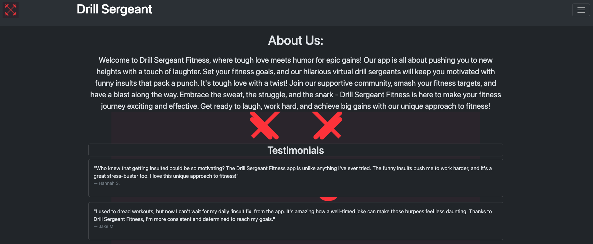
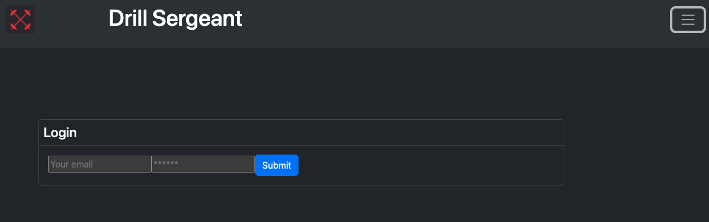
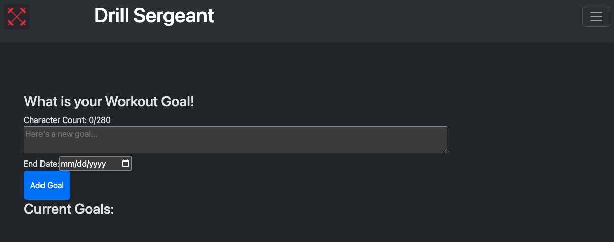
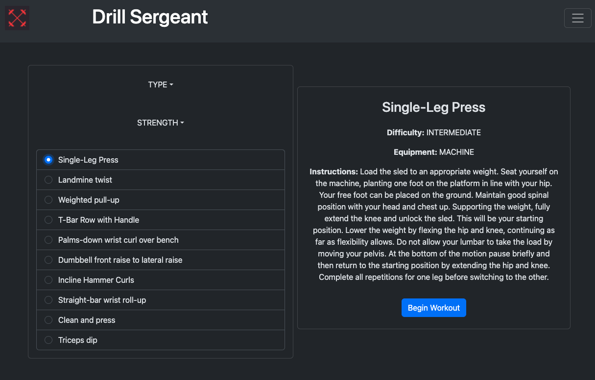
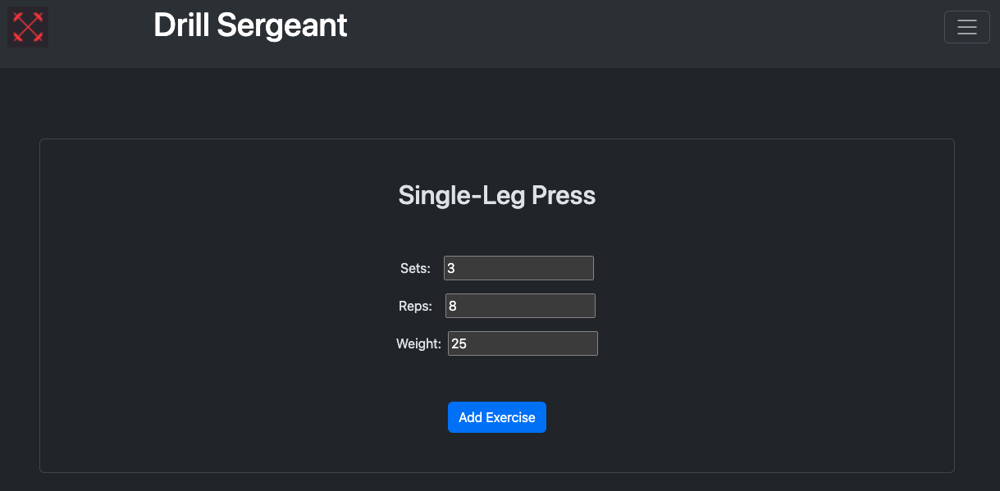
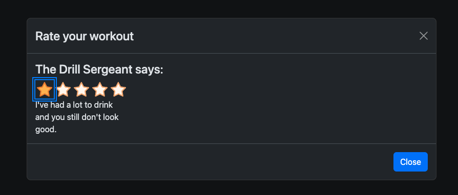
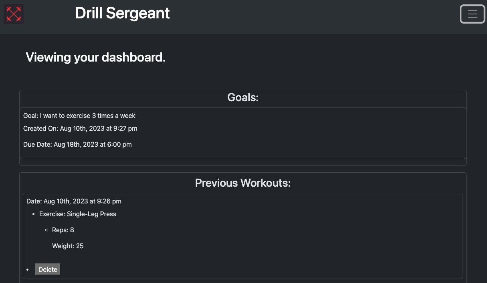

# Drill-Sergeant
A tough love fitness app that motivates you to get in shape with tough love quotes.

## Table of Contents
* [Installation](#installation)
* [User Story](#User-Story)
* [Description](#Description)
* [Usage](#Usage)
* [Credits](#Credits)

## User Story
As someone who is dedicated to fitness, I'm seeking a workout companion in the form of the "No Excuses Fitness" app. This app's unique approach involves using tough love motivation quotes to fuel my determination during workouts, driving me to get in shape and accomplish my fitness objectives with unwavering commitment.

## Description
Introducing "Drill Sergeant" – the uncompromising fitness app that brings the intensity of a boot camp to your workouts. Get ready to transform your fitness journey with tough love motivation quotes that push you beyond your limits. Designed to cut through excuses, "Drill Sergeant" ensures every workout counts, driving you to achieve your peak shape. Experience a new level of motivation, commitment, and results – because excuses have no place in your fitness success story.

Here is a link to our deployed app: 

Here are some screenshots showing the app functionality:
 
    
    
    
    
    
    

## Installation
Have Node.JS installed on your computer.
To install necessary dependencies, run the following command on the outer most directory: package.json [```npm i```]

## Usage
Email creators for usage rights and instructions.

## Credits
* [Tyler Mifflin]
* [Ever Muniz]
* [Connor McGrew]
* [Conner Christensen]


